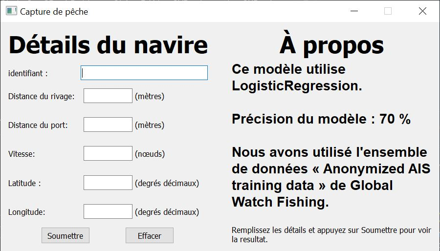

#  predictions application in Python

Cette application est réalisée à l'aide des bibliothèques d'apprentissage automatique sklearn et de pyqt5 pour son interface utilisateur graphique.
LogisticRegression classe les données d'entrée avec une précision de 70 %. Nous avons choisi l'ensemble de données offert par [Global Watch Fishing](https://globalfishingwatch.org/).



## INSTALATION :

Installez d'abord toutes les dépendances via la commande suivante.

```bash
pip3 install -r requirements.txt
```

Maintenant, entraînez l'application sur votre PC en tant que :

```bash
python3 src/model.py
```

Lancez enfin l'application :

```bash
python3 src/interface.py
```


## UTILISATION :

---> Après avoir lancer  l'application Insérez  les détails requis 

---> puis cliquez sur **Soumettre**.

---> La resulta s'affiche .


### DOCUMENTATION :

Capture de peche        # Dossier racine du projet (non versionner)
|

+--src                  #  contient l'ensemble des fichier python

|  |

|  +--_1_ model.py      # Entraînez le model en utilisant LogisticRegression 

|  |                    # Enregistrer le model sous format Pickle.

|  |

|  \--_2_ interface.py  # Lancez l'application avec interface graphique .

|  

\--data                 # Dossier contient les fichier du donnes.

|  |

|  \--data.csv          # fichier de donnes .

|
+--model                # contient les fichiers de model
|  |
|  \--_1_ model.pkl     # le model entrainer(Cree apres l'exucution de **model.py**)
|
+-- captures            # Contient les capture de l'application .
|
+-- requirement.txt     # Contient les dépendances a installer .
|
\-- README.md
